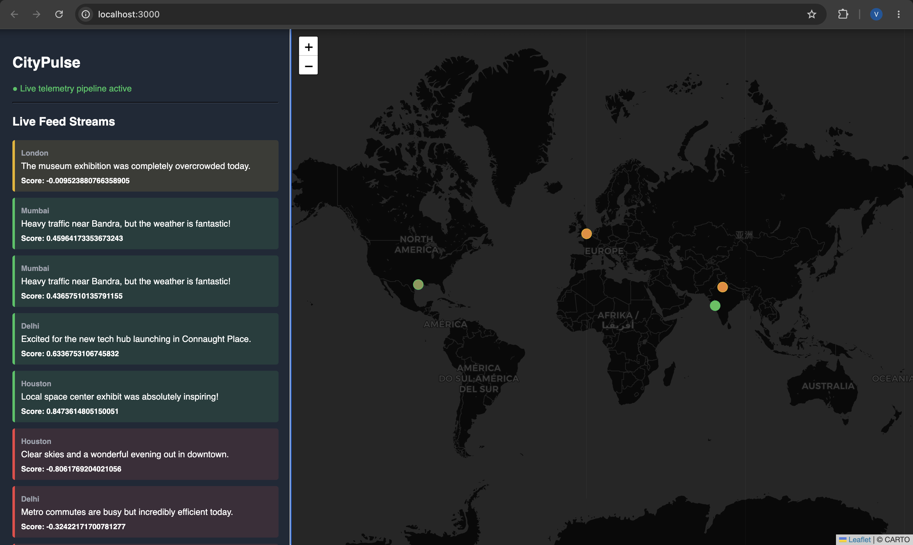
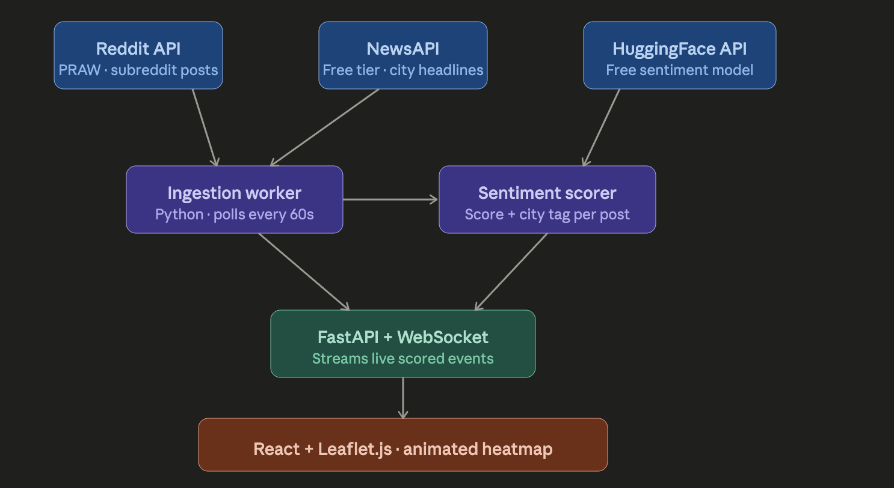

# CityPulse Telemetry

A high-performance, real-time telemetry streaming pipeline that processes mock geographical event data through an asynchronous backend engine and broadcasts updates over persistent WebSocket connections to a dynamic React visualizer.

The application is engineered to decouple high-frequency data ingestion from UI rendering. By establishing a persistent wss:// network pipe, the system avoids the overhead of traditional HTTP polling, ensuring low-latency data delivery and smooth 60FPS geographical marker updates on the frontend interface.

<p align="center">
  
</p>

---

## Table of Contents
1. [System Architecture](#1-system-architecture)
2. [Directory Structure and File Roles](#2-directory-structure-and-file-roles)
3. [WebSocket Communication Protocol](#3-websocket-communication-protocol)

---

## 1. System Architecture

The application is architected as two decoupled, specialized layers communicating via a persistent, asynchronous network gateway. The data processing mechanics flow sequentially from external third-party API ingestion points down to an isolated, state-driven client-side visualization canvas.

### Core Data Flow Schematic

To document the underlying data flow and processing pipeline, the following schematic map tracks the architectural layout from initial collection pools to frontend rendering layers:

<p align="center">
  
</p>

### Pipeline Component Roles

#### Server-Side Layer (FastAPI Engine)
* **Data Aggregation Worker:** An asynchronous Python background thread polls active post structures from the **Reddit API** (via PRAW) and global city headlines from the **NewsAPI** concurrently on a scheduled 60-second execution loop.
* **Sentiment Evaluation Matrix:** Collected text frames are instantly evaluated through a **HuggingFace API** transformer model pipeline to append precise polarity scores (ranging from `-1.0` for negative up to `+1.0` for positive sentiment) alongside corresponding geographic data tags.
* **FastAPI Streaming Gateway:** Processed data models are structured into clean JSON tokens and pushed straight into an internal connection pool handled by a high-performance `@app.websocket("/ws")` network route running on top of an ASGI server.

#### Client-Side Layer (React Visualizer)
* **Asynchronous Socket Hook:** A custom state listener maintains an unbroken full-duplex communication channel with the data port, processing incoming text buffers on a separate rendering frame line.
* **Leaflet.js Map Canvas:** Ingestion coordinate models are instantly parsed and projected onto a hardware-accelerated dark-themed vector tracking map, updating live metrics smoothly without forcing global document re-renders.

---

## 2. Directory Structure and File Roles

The codebase is organized into isolated modules that enforce a strict separation of concerns between real-time data handling and visualization layers:

### Server-Side Core (`/backend`)
* `main.py` — Establishes the primary ASGI application instance and configures cross-origin resource sharing (CORS). It exposes the stateful `@app.websocket("/ws")` gateway and runs the background broadcasting tasks.
* `ingestion.py` — Drives the simulated data pipeline. It formats geographic attributes, constructs event strings, and processes raw telemetry data frames before queuing them for broadcast.

### Client-Side Core (`/frontend`)
* `useCityPulse.js` — A specialized React hook that handles the browser's native WebSocket state. It tracks connection health, manages cleanups on unmount to prevent memory leaks, and streams parsed JSON payloads to the UI layer.
* `SentimentMap.js` — The primary interface component. It consumes telemetry arrays from the network hook, updates localized map canvases dynamically using `react-leaflet`, and maps marker attributes directly to live sentiment trends.

---

## 3. WebSocket Communication Protocol

Communication follows a standard, stateful full-duplex TCP socket model utilizing strict unidirectional JSON streaming payloads.

### Connection Workflow
1. The client visualizer initializes and opens a connection to `ws://localhost:8080/ws`.
2. The FastAPI server accepts the connection handshake and registers the client into the active session pool.
3. The backend begins streaming periodic telemetry data frames until the client terminates the connection or network failure occurs.

### Data Payload Schema
The server broadcasts serialized JSON packets structuring the telemetry events as follows:

```json
{
  "city": "Mumbai",
  "lat": 19.0760,
  "lon": 72.8777,
  "text": "Live mock event: Data pulse received.",
  "sentiment_score": 0.52659
}